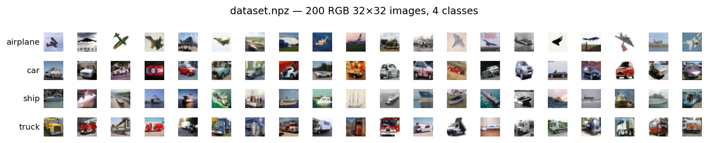
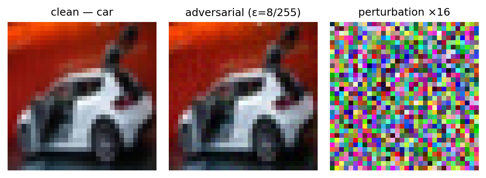
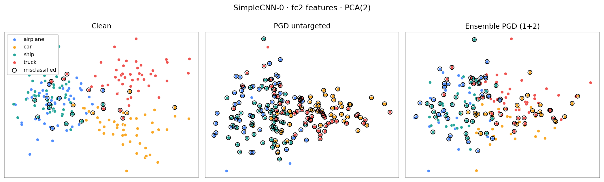

# adversarial-lens

> An interactive playground for studying how adversarial attacks reshape a
> CNN's representation space — built on top of three small `SimpleCNN`
> classifiers trained on a 200-image, 4-class dataset
> (`airplane / car / ship / truck`).

[**View on GitHub**](https://github.com/) ·
[Streamlit UI](#the-streamlit-ui) ·
[Embedding lens](#the-embedding-lens) ·
[Run it locally](#run-it-locally) ·
[Architecture](#architecture)

<p align="center">
  
</p>

---

## Why this exists

This project started as the answer to a *Trustworthy ML* homework (TAU, 2025).
The homework asks you to implement three adversarial attacks (PGD white-box,
NES black-box, PGD ensemble), measure transferability between three models,
and study how randomly flipping bits in the weights affects accuracy.

That part is now done — see the [PDF writeup](https://github.com/) — but the
result is a small, well-instrumented **adversarial-robustness lab**. It felt
wasteful to throw away. So I wrapped everything in a Streamlit UI and added a
**fifth probe** the homework didn't ask for:

> *Where in the network's representation space do adversarial examples
> actually live?*

A clean image lands somewhere in the **(N × D)** activation cloud of, say,
the penultimate layer. The same image, perturbed by 8/255, lands somewhere
else. Which "somewhere else"? Closer to the target class? Off the manifold
entirely? Does PGD push along the same axis as NES? Does ensemble PGD make
adversarials look more like a different class' clean samples?

The embedding tab answers all of these.

---

## The Streamlit UI

The UI has **six tabs**, each one a self-contained probe:

| Tab | What you can do |
|---|---|
| 🔍 **Inference** | Pick a model, pick an image, see softmax bars + raw logits |
| ⚔️ **Adversarial attack** | Craft PGD / NES / ensemble adversarials on a single image, see clean vs. adversarial side-by-side, view the perturbation ×16 |
| 📊 **Batch metrics** | Full-dataset accuracy, per-class accuracy, confusion matrix for any subset of CNN-{0,1,2} |
| 🔄 **Transferability** | 3 × 3 transferability matrix — *attack on CNN-i, evaluate on CNN-j* — for targeted or untargeted PGD, plus an ensemble row (1+2 → 0) |
| 🧮 **Bit-flip** | Random single-bit flips in random weights, RAD distribution per bit index (sign / exponent / mantissa) |
| 🌌 **Embeddings** | **(NEW)** Dump features from any layer of any model for clean + every attack, reduce to 2D with PCA / t-SNE / UMAP / Isomap / MDS / Kernel-PCA / random projection, see them side-by-side |

<p align="center">
  
</p>

---

## The embedding lens

This is what the new tab gives you:

<p align="center">
  
</p>

Same 200 images, same SimpleCNN-0, same `fc2` layer, same PCA. The only
difference is what we feed in:

- **Clean** — the four classes form clearly separated clusters; about 87% of
  points predict their true class.
- **PGD untargeted (ε = 8/255)** — the clusters tear apart. Most points land
  inside the "wrong" colour neighbourhood; classification accuracy drops to
  ~5%.
- **Ensemble PGD (sources = CNN 1+2, eval on CNN 0)** — fewer points cross
  cluster boundaries than PGD-on-CNN-0, but the ones that do tend to move
  along the *same* axes — visual evidence for the transferability
  literature.

You can swap PCA for **t-SNE / UMAP / Isomap / MDS / Kernel-PCA**, pick a
different layer (`conv2` looks like a slug, `fc2` looks like four blobs,
`logits` is a 4-point simplex), and tick more attacks on/off. Every bundle is
cached on disk, so re-selecting an old combination is instantaneous.

### Pluggable on purpose

Adding a new reducer is **one decorator**:

```python
# ui/embedding_reducers.py
@register("trimap", needs="trimap")
class TrimapReducer(BaseReducer):
    def fit_transform(self, X):
        import trimap
        return trimap.TRIMAP(n_dims=self.n_components).fit_transform(X)
```

…and it shows up automatically in the UI dropdown, gated by whether its
optional dependency is importable.

Adding a new attack is similarly small: extend
`embeddings.default_attack_specs(...)` with a new `AttackSpec(...)` and the
UI offers a checkbox for it.

---

## Run it locally

```bash
git clone https://github.com/<you>/adversarial-lens.git
cd adversarial-lens
pip install -r requirements.txt
python ui/run.py             # opens http://localhost:8501
```

It works on CPU. GPU (`cuda` / `mps`) is auto-detected and used via the
sidebar device picker if available.

### Try it from the command line

The non-UI driver scripts the homework specifies are still there and produce
the same numbers / figures as the original assignment:

```bash
python main_a.py     # whitebox + blackbox attacks + queries/momentum boxplots
python main_b.py     # transferability matrix + ensemble attack
python main_c.py     # bit-flip RAD distribution
```

---

## Architecture

```
adversarial-lens/
├── attacks.py / utils.py / models.py / consts.py    # course-shaped API
├── dataset.npz / trained-models/                    # data + checkpoints
├── main_a.py main_b.py main_c.py                    # original driver scripts
├── writeup/                                         # PDF + LaTeX source
├── ui/
│   ├── app.py                  # 6-tab Streamlit app
│   ├── pipeline.py             # facade over student modules
│   ├── viz.py                  # plotly + image helpers
│   ├── embeddings.py           # feature extraction + per-attack bundles + cache
│   ├── embedding_reducers.py   # pluggable PCA/t-SNE/UMAP/Isomap/MDS/...
│   └── embedding_viz.py        # interactive scatter, small multiples, drift
├── scripts/
│   ├── view_dataset.py
│   └── render_docs_assets.py   # regenerates the images on this page
└── docs/                       # this site (GitHub Pages)
```

The split is intentional:

- `attacks.py / utils.py` stay **exactly as the homework expects** so the
  driver scripts and the grader keep working.
- `ui/pipeline.py` is a thin facade so the Streamlit app never reaches into
  PyTorch internals directly.
- `ui/embeddings.py` is the new code that turns *(model, layer, attack, image
  index)* into a cached `(N, D)` activation matrix.
- `ui/embedding_reducers.py` is a tiny plug-in registry. Everything else in
  the UI just calls `cached_fit_transform(name, X, ...)`.

### Scaling beyond 200 images

The pipeline is dataset-size agnostic. To run on CIFAR-10 or a larger custom
set:

1. Drop a new `dataset.npz` (or change `pipeline.load_raw_dataset` to read
   your format).
2. Bump the batch size in `consts.py`.
3. Adjust the reducers — t-SNE and MDS stop scaling around 10–50k points;
   PCA and random projection are linear in N.

The on-disk embedding cache means each `(model, layer, attack, ε)` snapshot
only pays its cost once.

---

## Credits

- Homework specification & dataset: Mahmood Sharif, *Trustworthy ML*, TAU 2025.
- Solutions, UI scaffolding, embedding tab: the repo author.
- t-SNE / Isomap / MDS / KernelPCA: scikit-learn. UMAP: `umap-learn`.
  Streamlit + Plotly for the UI.
